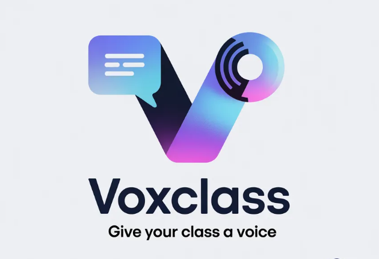

<p align="center">
  
</p>

# VoxClass — Real-Time AI Teaching Co-Pilot


Built for the **Shortcut Asia Internship Challenge 2026** — delivered as a working full-stack prototype in one week.

## The problem

A lecturer finishes explaining a concept and asks "any questions?" — silence. The exam results later show half the class didn't understand. Silence isn't understanding; it's disengagement that stays invisible until it's too late to fix.

VoxClass surfaces that signal live. Students react in real time, and the lecturer sees confusion the moment it happens — in a 30-student class, a confusion spike is visible in under 3 seconds.

## What it does

A lecturer starts a session; students join with a 6-digit code or QR — no student accounts needed.

| Role | What they get |
|---|---|
| **Lecturer** | Live mood meter, confused-student alerts, AI clarifying questions, slide upload → AI quiz generation, post-session AI insights |
| **Student** | One-tap reactions (got it / unsure / confused), live shared slide viewer, anonymous questions, pushed quiz questions |

The features chain rather than stand alone: a spike in 🔴 reactions triggers the confused panel → one tap generates targeted clarifying questions from the current slide via Gemini → the lecturer pushes the best one to every student instantly → the post-session summary explains *why* that topic caused confusion.

Other capabilities: PowerPoint-style slide sharing (JPG/PNG/PDF/PPTX) with per-page sync broadcast to all students, anonymous question clustering by theme, and **Polish Mode** — Gemini-powered rewriting of feedback text in four tones (soften / strengthen / academic / simplify) with word-level diff.

## Architecture

```
lib/
├── main.dart                    # App entry — loads .env, inits Supabase
├── app.dart                     # MaterialApp.router + theme
├── core/
│   ├── constants.dart           # .env key accessors
│   ├── router.dart              # go_router + auth redirect notifier
│   └── theme/                   # Dark theme
├── models/                      # Profile, Session, Reaction, Slide, Question…
├── providers/                   # Riverpod: auth state, realtime streams
├── services/
│   ├── supabase_service.dart    # All DB + auth operations
│   ├── gemini_service.dart      # AI calls with retry + fallback defaults
│   └── storage_service.dart     # Slide upload/download (Supabase Storage)
└── features/
    ├── auth/  ├── dashboard/  ├── onboarding/
    ├── class_mode/              # lecturer/, student/, shared widgets
    └── polish_mode/
```

Design decisions worth noting:

- **Realtime over polling.** Reactions, pushed questions, and slide changes ride Supabase Realtime (Postgres logical replication → websockets), so the mood meter and student slide viewers update without any refresh loop.
- **Feature-first structure.** Code is organized by feature (`class_mode`, `polish_mode`) rather than by layer, keeping each user flow self-contained.
- **Resilient AI calls.** Every Gemini call retries with exponential backoff (3 attempts) and parses structured JSON with safe fallbacks, so a flaky or malformed model response degrades gracefully instead of crashing a live class.
- **Row Level Security on every table**; Realtime enabled only where the UI needs it (`reactions`, `ai_questions`, `slides`, `sessions`).

## Database schema

```
profiles            user id, full_name, role (lecturer/student)
sessions            lecturer_id, title, subject, code, status
reactions           session_id, student_id, type (green/yellow/red)
slides              session_id, file_url, order_index, speaker_notes
ai_questions        session_id, slide_id, question_text, is_pushed
question_responses  question_id, student_id, response_text
polish_logs         user_id, input_text, output_text, mode
```

Full schema with RLS policies: [`supabase/schema.sql`](supabase/schema.sql).

## Tech stack

| Layer | Technology |
|---|---|
| Framework | Flutter 3.x (Android, iOS, desktop, Web) |
| AI | Google Gemini 1.5 Flash — text + vision multimodal |
| Backend | Supabase (Auth, PostgreSQL, Realtime, Storage) |
| State | Riverpod 2.x |
| Navigation | go_router 14.x with auth redirect |
| Charts / QR / Motion | fl_chart · qr_flutter · flutter_animate |

## Setup

Prerequisites: [Flutter SDK 3.x](https://docs.flutter.dev/get-started/install), a free [Supabase](https://supabase.com) project, a free [Gemini API key](https://aistudio.google.com/apikey).

```bash
git clone https://github.com/Lovemore-1/voxclass.git
cd voxclass
flutter pub get
cp .env.example .env     # fill in your own keys — see below
flutter run -d chrome
```

`.env`:

```
SUPABASE_URL=https://your-project.supabase.co
SUPABASE_ANON_KEY=your_anon_key
GEMINI_API_KEY=your_gemini_api_key
```

Supabase setup:

1. Run the contents of `supabase/schema.sql` in the SQL Editor.
2. Enable Realtime on `reactions`, `ai_questions`, `slides`, `sessions`.
3. Create a public Storage bucket named `slides`.

### Try the full loop (two browser windows)

1. `flutter run -d chrome` → sign up as **Lecturer** → **Start Class** → copy the 6-digit code.
2. Incognito window, same URL → sign up as **Student** → join with the code.
3. Send reactions as the student and watch the lecturer's mood meter move in real time.
4. Upload an image slide → **Ask Gemini** → three quiz questions generated from the slide content.

## Future improvements

- Replace per-reaction rows with windowed aggregation for very large classes.
- Speech-to-text capture of the lecture audio to give Gemini richer context than the slide alone.
- LMS integration (Moodle/Canvas) for session rosters and grade export.

## License

MIT
